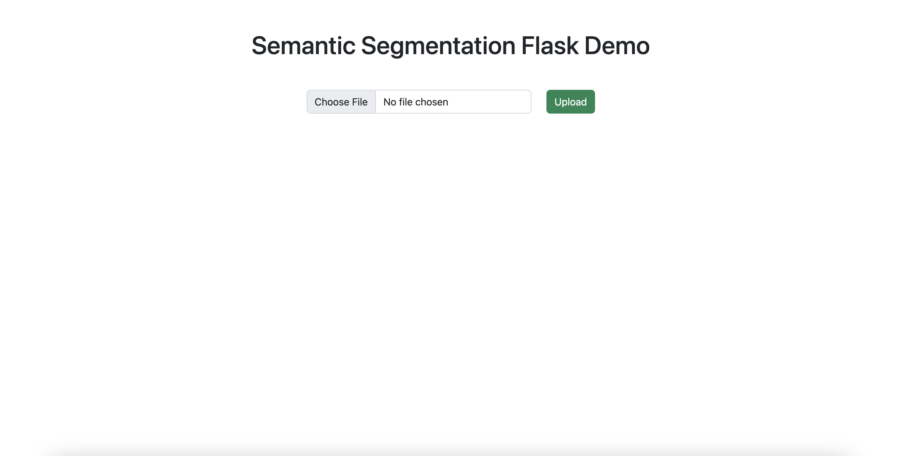
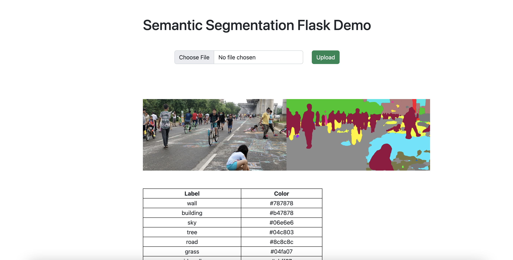

# Semantic Segmentation Flask Demo

1) Flask is a micro web framework written in Python.
2) SemanticSegmentationModel Your own semantic segmentation model
## Get Online Demo from AWS
Access: http://ec2-34-226-138-182.compute-1.amazonaws.com:4999/
## Project stucture
```
root
    |data: contains class/color of object
    |semseg_model: model architecture/checkpoints
    |templates: html files for frontend
    |utils: visualization helper for semantic segmentation
    |app.py: Flask app
    |Dockerfile
    |download_weight.sh: Download pretrained weight
    |inference.py: Inference model code
    |requirements.txt
```

### Build docker and run demo

```
cd path-to-this-project
docker build -t gnvml/semantic_segmentation .
docker run --rm -p4999:5000 -v$PWD:/code gnvml/semantic_segmentation
```

Access: http://localhost:4999/ to open demo website



